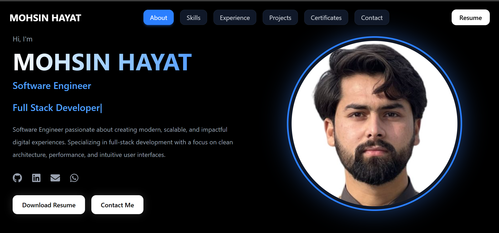
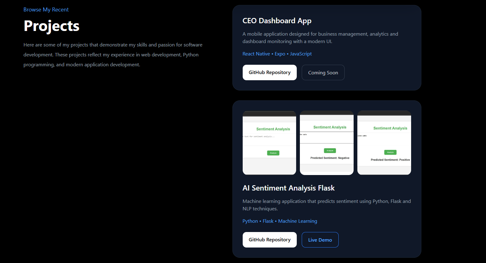
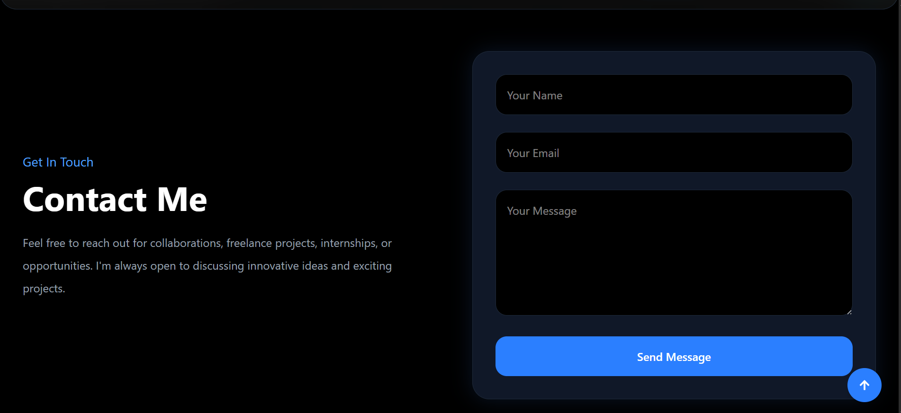
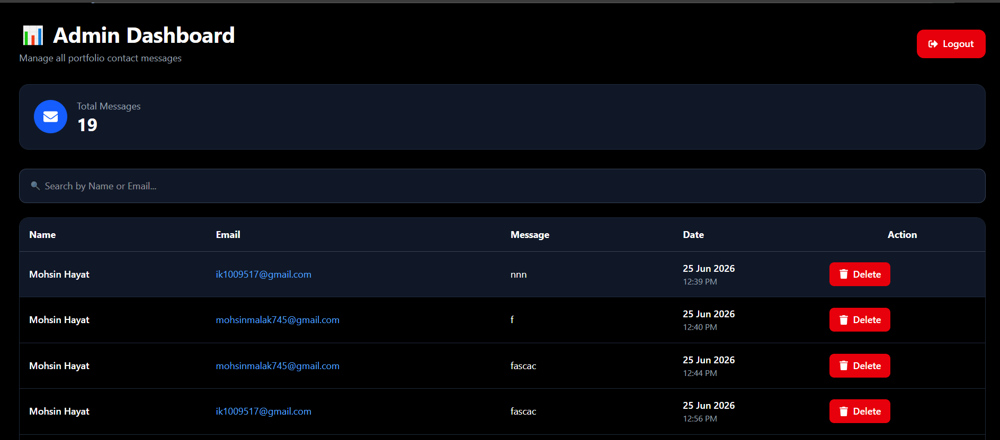

# 🚀 Mohsin Portfolio

A modern **Full Stack Portfolio Website** built with **React.js**, **Tailwind CSS**, **Node.js**, **Express.js**, and **MongoDB Atlas**. The project includes a responsive portfolio, secure admin dashboard, JWT authentication, contact form, email notifications, and message management.

---

## 🌐 Live Demo

**Frontend:**  
https://mohsin-portfolio-three.vercel.app/

**Backend API:**  
https://mohsin-portfolio-backend-lud6.onrender.com

---

## ✨ Features

### 🎨 Portfolio

- Responsive Design
- Hero Section
- About Section
- Skills
- Experience
- Projects
- Certificates
- Contact Form
- Resume Download
- Smooth Animations

---

### 📩 Contact System

- Send Messages
- Save Messages to MongoDB Atlas
- Email Notification using Brevo
- Form Validation

---

### 🔐 Admin Dashboard

- Secure Admin Login
- JWT Authentication
- Protected Routes
- View Contact Messages
- Delete Messages
- Search Messages
- Total Messages Counter
- Logout
- Loading Spinner
- Responsive Dashboard

---

## 🛠 Tech Stack

### Frontend

- React.js
- Vite
- Tailwind CSS
- React Router DOM
- Axios
- Framer Motion
- React Hot Toast
- React Icons

### Backend

- Node.js
- Express.js
- MongoDB Atlas
- Mongoose
- JWT
- bcryptjs
- Brevo Email API

### Deployment

- Vercel
- Render
- MongoDB Atlas

- ## 📂 Project Structure

```text
Mohsin-Portfolio
│
├── public
├── src
│   ├── assets
│   ├── components
│   ├── pages
│   ├── services
│   ├── App.jsx
│   ├── Portfolio.jsx
│   └── main.jsx
│
├── package.json
└── README.md
```

---

## ⚙️ Installation

Clone the repository:

```bash
git clone https://github.com/mohsinhayat11/Mohsin-Portfolio.git
```

Go to the project directory:

```bash
cd Mohsin-Portfolio
```

Install dependencies:

```bash
npm install
```

Start the development server:

```bash
npm run dev
```

---

## 🔑 Environment Variables

Create a `.env` file in the project root and add:

```env
VITE_API_URL=http://localhost:3000
```

For production:

```env
VITE_API_URL=https://mohsin-portfolio-backend-lud6.onrender.com
```

---

## 📸 Screenshots

### 🏠 Home Page



---

### 💼 Projects Section



---

### 📩 Contact Form



---

### 🔐 Admin Dashboard



---

## 🚀 Future Improvements

- Edit Messages
- Export Messages (CSV)
- Dashboard Analytics
- Dark / Light Theme
- Profile Management
- Pagination
- Reply to Messages

---

## 👨‍💻 Author

**Mohsin Hayat**

- GitHub: https://github.com/mohsinhayat11
- Portfolio: https://mohsin-portfolio-three.vercel.app/

---

## ⭐ Support

If you like this project, please consider giving it a ⭐ on GitHub.

---

## 📄 License

This project is licensed under the MIT License.

---
